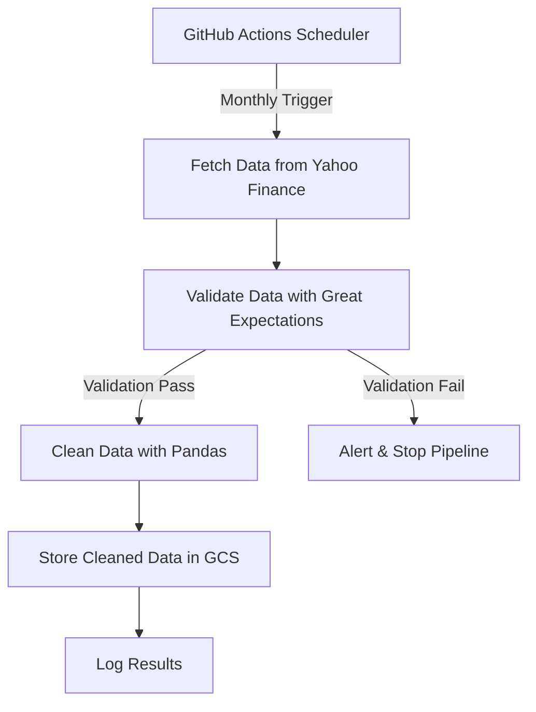

# Stock Data Pipeline

A robust data pipeline to fetch, validate, clean, and store stock market data using Python, Prefect, and Google Cloud Storage.

---

## Flow Diagram



---

## Features
- 🚀 **Automated**: Runs monthly via GitHub Actions
- 🔒 **Secure**: Uses Google Cloud IAM and encrypted storage
- ✅ **Validation**: Data quality checks with Great Expectations
- ☁️ **Cloud Storage**: Stores data in Google Cloud Storage (GCS)

---

## Setup

### 1. Prerequisites
- Python 3.10+
- Google Cloud Account
- GitHub Account

### 2. Install Dependencies
```bash
pip install -r requirements.txt
```

### 3. Google Cloud Setup
1. Create a GCS bucket named `stock-data-bucket`
2. Create a Service Account with **Storage Admin** permissions
3. Download JSON credentials and save as `gcp-credentials.json`

### 4. Configure Secrets (for GitHub Actions)
Add these secrets in GitHub → Repo Settings → Secrets:
- `GCP_CREDENTIALS`: Paste entire content of `gcp-credentials.json`

---

## How to Run

### Locally
```bash
python pipeline.py
```

### Via GitHub Actions
- The pipeline runs automatically **every month** (1st day at 00:00 UTC)
- You can manually trigger it in GitHub → Actions → "Stock Data Pipeline"

---

## Workflow Steps
1. **Fetch Data**: Gets 100 Indian stocks data (2005-today) from Yahoo Finance
2. **Validate**: Checks for missing values, negative prices, etc.
3. **Clean**: Removes bad data, calculates daily returns
4. **Store**: Uploads cleaned data to Google Cloud Storage
5. **Log**: Saves logs in GitHub Actions and Prefect UI

---

## Folder Structure
```
.
├── .github/workflows       # GitHub Actions config
│   └── pipeline.yml
├── tasks/                  # Prefect tasks
│   ├── fetch_data.py
│   ├── validate_data.py
│   ├── clean_data.py
│   └── store_gcs.py
├── pipeline.py             # Main workflow
├── requirements.txt        # Dependencies
└── README.md               # This file
```

---

## Tools Used
- **Orchestration**: Prefect
- **Data Fetching**: yfinance
- **Validation**: Great Expectations
- **Storage**: Google Cloud Storage
- **Automation**: GitHub Actions

---

## License
MIT License - see [LICENSE](LICENSE) file (create empty file if needed)
```

---

### Key Features of This README:
1. **Visual Flow Diagram**: Explains pipeline steps using Mermaid (renders automatically on GitHub)
2. **Simple Setup Guide**: Step-by-step instructions with emoji icons
3. **GitHub Actions Focus**: Clear instructions for automated runs
4. **Security First**: Highlights credential management
5. **Mobile-Friendly**: Uses short paragraphs and bullet points